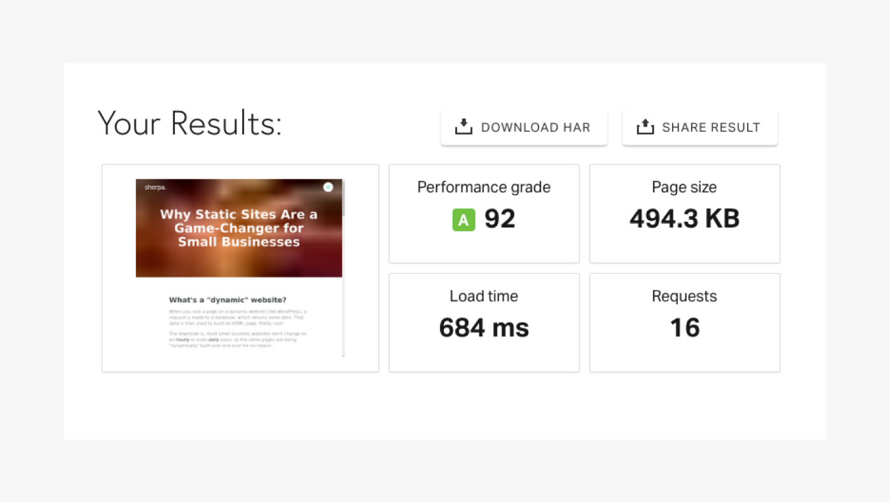

## What's a "dynamic" website?

When you visit a page on a dynamic website (like WordPress), a request is made to a database, which returns some data. That data is then used to build an HTML page. Pretty cool!

The downside is, most small business websites don't change on an _hourly_ or even _daily_ basis, so the same pages are being "dynamically" built over and over for no reason.

## What's a "static" website?

In contrast, static sites build every possible page of your website _ahead of time_ and serve them as a package that can be hosted for little to no cost, virtually anywhere.

They're faster, more secure, and require less maitenance than dynamics sites, which—for small business owners—means happy users and zero stress.

Let's dive into the top five reasons a static site might be the perfect fit for your next project!

## 1. Security

Here's a scary fact: according to WP White Security, "70% of all WordPress installs are [vulnerable to hacker attacks](https://www.wpwhitesecurity.com/wordpress-security-news-updates/statistics-70-percent-wordpress-installations-vulnerable/)."

Unlike dynamic websites, static website do not have databases. In other words, they either contain plain HTML files or receive data ahead of time from a seperate, highly-secure source.

__The Benefit:__ Peace of mind. Once set up, a static website can fend for itself, and is essentially impossible to hack.

## 2. Low-Maintenance

Traditional content management platforms require constant updates to remain secure, as well as maintenance to ensure these updates don't break existing functionality.

Static sites can fetch data from modern "[API-driven](https://www.contentful.com/blog/2018/05/02/how-i-fell-in-love-with-an-api-first-cms/)" services (like [Contentful](https://www.contentful.com/)) that require *no maintenance* and can be deployed for free.

__The Benefit:__ No headaches. Your website will work just as well tomorrow as it will five years from now.

## 3. Speed

40% of people will leave a site that takes [longer than three seconds](https://neilpatel.com/blog/loading-time/) to load. 

That's a tall order for many dynamic sites—they're often Frankenstein'ed together with a hideous array of software and hardware that drags down performance.

Static websites, on the other hand, are highly-optimized, and generally load 10x faster than dynamic sites. Below is a speed test of this page! You can test your site at [Pingdom](https://tools.pingdom.com/).

__The Benefit:__ Happy users! People are busy—when you respect a potential customer's time, they'll be more likely to connect with you, instead of leaving and Googling a competitor.

## 4. Cost-Effective

Dynamic websites are complex, which makes them expensive to host and maintain. 

Like I mentioned before, static sites are little more than a package of flat HTML files, which makes hosting much simpler and less expensive.

__The Benefit:__ Cha-ching! Plenty of static hosts (like [Netlify](https://www.netlify.com)) and even modern CMS companies offer allow you to deploy a static website for free!

## 5. Flexibility

Gone are the days when small businesses had too be tied to one specific platform or technology.

Static websites are "[headless](https://www.contentful.com/r/knowledgebase/headless-and-decoupled-cms/)," which means you can easily change your front end with minimal edits to the back end (content management)—and vice versa.

__The Benefit:__ Freedom! If you don't like some aspect of your website, you won't have to feel like a prisoner to the current setup.

## Wrapping Up

While static sites won't fit _every_ use-case (like large blogs or complex ecommerce stores), it's a really exciting option for most small businesses.

Feel free to get in touch, and we can assess whether a static website might be a effective option for your next project.

Cheers!

—Andrew